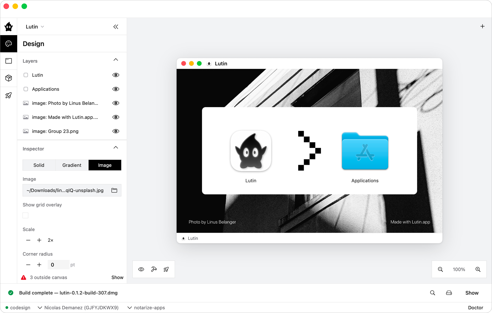

<div align="center">

<picture>
  <source media="(prefers-color-scheme: dark)" srcset="docs/lutin.icon/Assets/lutin-logo-icon-dark.svg">
  
</picture>

# Lutin



**Design, build, sign, and notarize macOS DMGs — with a native app and an agent-operable CLI.**

[](LICENSE)
[](#requirements)
[](https://swift.org)
[](https://github.com/Halloweedev/lutin/releases)

</div>

---

Shipping a Mac app outside the App Store means wrestling with `hdiutil`, AppleScript window-layout hacks, `codesign`, `notarytool`, and `stapler` — every release, on every machine. Lutin replaces that pipeline with three things:

- **One `lutin.yml`** you can hand-edit or generate — the single source of truth.
- **A CLI (`lutin`)** for CI and scripting, with `--json` on every subcommand and exit codes that mean something.
- **A native macOS visual editor** for when you want to *see* the DMG before you ship it.

Every action the GUI takes flows through the same intent layer the CLI's `apply-intents --json` uses — so an AI assistant (Claude Code, Cursor, etc.) can drive Lutin end-to-end and produce byte-for-byte the same artifact a human would.

## Highlights

- **Visual DMG editor** — drag your `.app`, position icons on a 1:1 device-pixel canvas, set window size, sidebar/toolbar chrome, background image, and the `Applications` shortcut.
- **Real build pipeline** — `hdiutil`-based DMG assembly with Finder-compatible layout metadata. No AppleScript hacks.
- **Signing & notarization built in** — pickers populated from `security find-identity` and `xcrun notarytool list-keychain-profiles`. Sign, notarize, staple, verify.
- **Agent-operable** — every CLI subcommand supports `--json`; `apply-intents` accepts programmatic edits over stdin or file. See [AGENTS.md](AGENTS.md).
- **Preview before you ship** — `lutin preview` builds, mounts, and opens the DMG in Finder.
- **Doctor** — `lutin doctor` checks signing identities, notary profiles, required tools, and release readiness before you hit publish.

## Install

### CLI

Free, no limits, no licensing flow.

```sh
# Homebrew
brew install halloweedev/lutin/lutin

# Or download the latest release
# https://github.com/Halloweedev/lutin/releases
```

Installs a prebuilt universal binary (Apple Silicon + Intel) — no Xcode needed.

### App

Download the latest **Lutin.app** `.dmg` from [Releases](https://github.com/Halloweedev/lutin/releases). Free for up to **10 DMG projects** — see [Free vs Pro](#free-vs-pro).

## Quickstart

```sh
# In a directory next to your built .app
lutin init --app ./build/MyApp.app
lutin doctor          # check signing/notary readiness
lutin build           # produce an unsigned DMG
lutin release         # build, sign, notarize, staple
lutin preview         # mount and open the result in Finder
```

`lutin.yml` is the source of truth — both the GUI and the CLI read and write it. See [`Examples/Barry`](Examples/Barry) for a complete sample project.

## CLI reference

| Command | What it does |
|---|---|
| `lutin init [--app PATH] [--template NAME]` | Write `lutin.yml` in the current directory and register the project. |
| `lutin projects` | List registered projects. |
| `lutin add PATH [--name NAME]` | Register an existing project. |
| `lutin remove NAME` | Remove a project from the registry. |
| `lutin open --name NAME` | Open a registered project. |
| `lutin validate [--config PATH \| --name NAME]` | Validate `lutin.yml`. |
| `lutin doctor [--config PATH \| --name NAME]` | Check release readiness (tools, identities, profiles). |
| `lutin build [--config PATH \| --name NAME] [--json]` | Build an unsigned DMG. |
| `lutin release [--config PATH \| --name NAME] [--json] [--dry-run]` | Build, sign, notarize, and staple. |
| `lutin preview [--config PATH \| --name NAME] [--json]` | Build, mount, and open the DMG in Finder. |
| `lutin notary setup [--profile NAME] ...` | Store a `notarytool` keychain profile. |
| `lutin apply-intents --config PATH [--file intents.json] [--json]` | Apply editor intents to a project file (stdin if `--file` omitted). |

Every command accepts `--help`, and `lutin --version` prints the version. Output-producing commands accept `--json` for machine consumption.

## Free vs Pro

The **CLI is free forever** with no limits. Use it in CI, scripts, agents — anywhere.

The **app is free for up to 10 DMG projects**. Past that, a Pro license unlocks unlimited projects. A non-blocking sheet appears every 30 days inviting you to support development — you can dismiss it instantly and keep working.

Pro licenses are issued and validated via [**Keylight.dev**](https://keylight.dev). Lutin is also a real-world reference implementation for Keylight integration.

> **Why a paid tier?** Lutin is open source under GPL-3.0 — you can read every line, build it yourself, and audit the gate. The paid tier exists to support development and lift the 10-project cap.

## Requirements

- macOS 15 (Sequoia) or later
- For signing: a Developer ID Application certificate in your keychain
- For notarization: a `notarytool` keychain profile (`lutin notary setup --help`)

## Building from source

```sh
git clone https://github.com/Halloweedev/lutin.git
cd lutin
swift build
swift run lutin --help

# Run the GUI in dev mode (recommended)
./scripts/dev-app.sh
```

The **CLI builds with no extra setup** — it doesn't link the licensing module.

The **GUI app** (`lutin-app`) does, and you have two options:

1. **Use Keylight (default).** Sign up at [keylight.dev](https://keylight.dev), grab an SDK key, then:
   ```sh
   cp Sources/LutinUI/Secrets.swift.example Sources/LutinUI/Secrets.swift
   $EDITOR Sources/LutinUI/Secrets.swift   # paste your sdk_test_* or sdk_live_* key
   ```
   `scripts/dev-app.sh` auto-creates `Secrets.swift` from the template if it's missing, so you can also just edit it after the first run.

2. **Strip the licensing layer.** GPL-3.0 lets you build a fork without any licensing flow. Replace `Sources/LutinUI/Licensing.swift` with a stub that no-ops `LicensingHooks.checkOnLaunch()`/`refreshIfNeeded()` and exposes a `manager` with `isEntitled = true`, then edit `Sources/LutinLicense/LicenseGate.swift` so `canCreateProject` always returns `true` and `shouldShowSupportNag` always returns `false`. You can then drop the `KeylightSDK` dependency from `Package.swift`. Per [TRADEMARKS.md](TRADEMARKS.md), a rebranded fork is fine; just don't ship it as "Lutin".

`swift run lutin-app` runs the bare SwiftPM executable and is mainly useful for debugging process startup from a terminal — `scripts/dev-app.sh` is what you want for normal dev.

## Tests

```sh
swift test
```

Runs the full suite, including macOS integration tests that create, mount, inspect, and detach DMGs with `hdiutil`. If a run is interrupted a temporary volume may be left mounted — detach it with `hdiutil detach /Volumes/<name> -force`.

Fast iteration filters:

```sh
swift test --filter LutinCLITests
swift test --filter LutinConfigTests
swift test --filter LutinDocumentTests
swift test --filter LutinUITests
```

Avoid `LutinBuilderTests`, `LutinReleaseTests`, and unfiltered runs unless you intentionally want the DMG/build/release integration coverage.

## Repository layout

```
Sources/         Swift modules (Core, Config, Builder, Render, Signing, …)
Apps/            Executable targets (CLI, App, Packager, Headless)
Tests/           Swift Testing + XCTest suites
Examples/        Sample lutin.yml projects
scripts/         dev-app.sh, release-app.sh, verify-editor-parity.sh, …
homebrew/        Homebrew formula (mirrored to the halloweedev/lutin tap)
docs/            Notes, specs, and brand assets
.github/         CI workflows (release-cli.yml builds the universal binary)
```

## Contributing

Issues, bug reports, and pull requests are welcome — open one on GitHub. For security issues, please use GitHub's **private vulnerability reporting** on this repo rather than filing a public issue.

## License & trademarks

- **Code:** [GPL-3.0](LICENSE). Forks are welcome and must remain GPL-licensed.
- **Name & marks:** "Lutin", the Lutin logo, and the official signed binaries are protected — see [TRADEMARKS.md](TRADEMARKS.md). Forks must rebrand.
